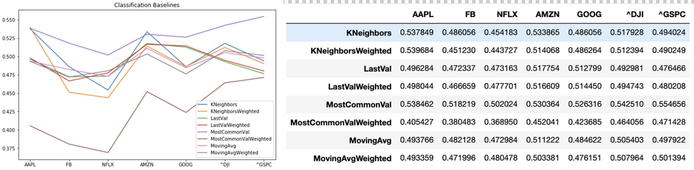
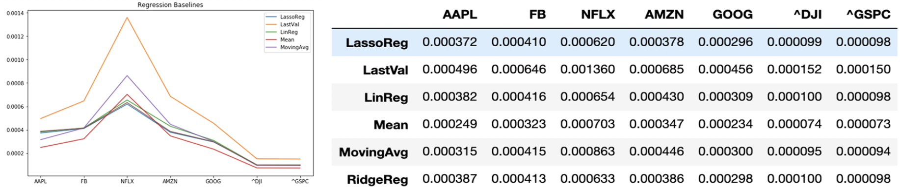
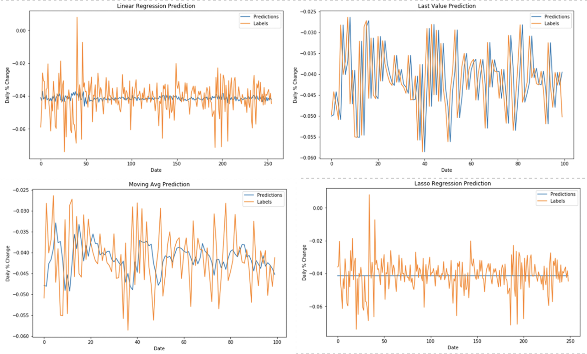
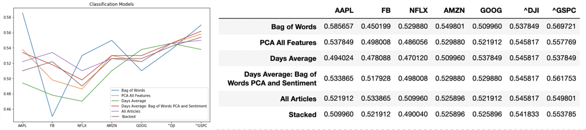
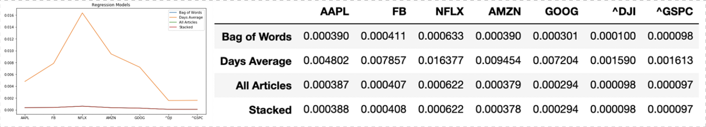

# Using News to Predict Stock Movement

## Introduction 
Predicting the stock market has always been a very difficult task, despite the volumes of data available for analysis. Many different factors that influence the stock market are at play - not only related to the company associated with a stock, but also related to the public's perception of a stock, recent economic events, political developments, and more. Investment and asset management firms have spent billions on building models that are able to accurately assess the future direction of stocks, and even they are not always successful; it's nearly impossible to include everything that might have an effect on a stock into a predictive model. One big step towards doing this in recent years has been incorporating news data in models. The news contains huge amounts of information about what's going on in the world - some of it undoubtedly relevant to the stock market. 

## Problem 
Our goal is to determine what predictive power business news found online online can add to basic stock price prediction models. We hope that through the use of natural language processing tools, the vast amounts of information contained in the news can be compressed into a potentially useful set of features that will increase the accuracy of models that incorporate these features. 

## Data
Our dataset is split into two categories: stock market data and news data. Both our stock market data and news data span nearly five years - from Jan. 1, 2015 to Oct. 31, 2019.

The stock market data consists of daily stock prices for Facebook, Amazon, Apple, Netflix, and Google as well as the daily index levels for the Dow Jones Industrial Average (DJIA) and the S&P 500. We obtained the data from Yahoo Finance. While the stock market indexes chosen (DJIA and S&P 500) are representative of the stock market as a whole, we thought it would also be interesting to include several individual stocks to see if our news data might be more useful on a more specific scale than for predicting the movement of the whole stock market. We ended up having 1,215 data points for each stock and index, including the following features:
- Date
- Open
- Close
- High
- Low
- Adjusted Close
- Volume

We collected our news data from the New York Times. These data include articles from each day in our specified time period and include many features, of which we determined the following to be most relevant:
- Abstract
- Source
- Keywords
- Publication Date
- Headline

In total, after cleaning our data, we had 82,533 articles in our news dataset. 

### Preprocessing 
Both our stock data and news data required some preprocessing before we started any analysis.

#### Stock Data 
Our stock data was very clean, but we needed to create a column to use as our target variable. Because we knew all of our models and analyses would be using time series data (for example, using the past $n$ days to predict the current day), we chose to use the normalized percent change in closing price as our target variable. This way when stock prices rise to prices much higher than they were in the past, this does not affect our models. Furthermore, based on some reading we did, when doing time series analysis, you want stationary data to make the analysis easier. Stationary data is data whose mean and standard deviation are not functions of time (1). We were able to achieve relatively stationary data by taking the normalized percent change in closing price. 

#### News Data 
The news data we collected was much less clean than our stock data. We cleaned this dataset by:
- Deleting irrelevant columns and columns with missing data. These columns included "website_url", "headline_seo", "snippet", and many others.
- Deleting rows with significant data missing in our most relevant columns.
- Combining related columns. For example, "headline" and "headline_kicker" combined to become "full_headline".
- Imputing values where relevant and useful. For example, we realized that one column, “print_page” had an NA value if its value was meant to be False.
- Converting categorical columns to one hot encodings

## Approach 
We decided to approach the problem by constructing and/or training models with and without news data and comparing the results to determine whether our news data had a significant effect on the predictive power of our models. The models without any news data would be our baseline models, and the models with news data our more advanced models. We decided to compare models for both the classification task of predicting whether our target variable, the percent change in closing price, went up or down, and the regression task of predicting the actual value of this variable. The measures of performance we decided to use for classification were accuracy and weighted accuracy, where weighted accuracy punished or rewarded our algorithms in proportion to the magnitude of the percent change our target variable. We used mean squared error to measure performance in our regression models. 

## Analysis 

### Baseline Models

#### Classification 
- Most Common Value - using the most common value in a training set as the prediction for test data
- Last Value - using the previous day's movement as the prediction for the current day
- Moving Average - using the mode prediction of the past n days as a prediction for the current day
- K-Nearest-Neighbors - taking the mode prediction for the k most similar data points' classifications based on their movements for n days into the past 

Here are the results of these models, where weighted accuracies are indicated in the rows with "Weighted" appended to the model name. For each model involving using the past n days or k as a parameter, we tried a range of values from 1-20, and chose the best performance for each. 

We were surprised to note that simply predicting the most common value in our training set outperformed our other baselines in most cases. However, note that the weighted average score for our more complex models is most often higher than for the most common value, indicating better predictions of our for more compex models in extreme cases of percent price change. In most cases, n < 10. 

#### Regression
- Mean Value - using the mean value in a training set as the prediction for test data
- Last Value - using the previous day's movement as the prediction for the current day
- Moving Average - using the moving average for the past n days as a prediction for the current day
- Linear Regression - fitting a linear regression to the data based using the past n days as features
- Lasso Regression - linear regression with L1 regularization 
- Ridge Regression - linear regression with L2 regularization 

Here are the results of these models. Again, for the models requiring parameters, we tried a range of values and selected the best results. We achieved the best results with n < 10

Here's a visualization of what these models predicted. We noticed that all of the regressions learned nearly the same weights - they simply ended up guessing that the price not change from the previous day, which would be identical to a last value model had we just used the closing price as our target variable rather than its normalized percent change.

### News Based Models
For our news based models, we experimented with creating several additional features from our news data.

#### Feature Selection and Engineering
The news features we created and found most useful included
- Top keywords found across our dataset as they occurred in each article. This involved writing an algorithm that compiled a list of all keywords, selected the top 1000 keywords and encoding the intersection of the keywords in the article and the top 1000 keywords as a many-hot encoding.
- A bag of words encoding for the abstract and full_headline for each article
- Sentiment analysis including positivity, negativity, neutrality, polarity, and subjectivity, and a compound score on the abstract and full_headline of each article
- N-grams with n=2 and n=3. This is very similar to our bag of words model but with the occurrence of n words in combination rather than single words encoded in a many-hot style.
- PCA with 10-20 principal components on either all of our features or just our bag of words and n-gram feature set

### Modeling 
Our first model that we trained on all of our features (news data included) was a logistic regression model. We continued with a basic accuracy measurement and a weighted accuracy measurement to determine the fit of our model.

Next we tried a linear regression model that used a daily average for all of the x and y datasets. For this model, we measured fit via mean squared error. The error values for all of our included stocks were approximately zero to two decimal places with the exception of Netflix. We then considered a logistic regression model that also used a daily average for all of the x and y datasets and measured fit via mean accuracy on the test sets. Our observed accuracy ranged from 47-55% for this model. Next, we considered the same logistic regression model but added principal component analysis (PCA) and sentiment. This model gave accuracy values ranging from 50-56% for each of the included stocks. Finally, we explored a stacked regression and classification with all of the features included. We stacked two classifier models: the first one being a basic logistic regression on the training set to predict an increase or decrease in stock price, the second one being another logistic regression that predicted which classifiers from the first regression are best. We then fit a linear regression model to predict the difference and a classification model to predict either an increase or decrease in stock prices. The accuracy values ranged from 51-55%.

After cleaning our dataset, we decided our next step was to begin constructing a few baseline models. To do so, we first put eighty percent of our data into a training set and the remaining twenty percent into a test set. After this, we built our first baseline classification model that predicted the most common stock value as the label for each respective stock. We then determined accuracy on the test set and received accuracy values ranging between 50-55%. Our next baseline classification model predicted the previous day’s price as the current day’s price. We anticipated that this would be more accurate than the previous model but we instead received accuracy values ranging between 47-52%. Thereafter, we tried one more baseline classification model that used a moving average of prices for the previous n days to predict the current day’s stock price, where we varied ‘n’ between the values of 3, 5, 7, and 9 to see if the variation affected our accuracy outputs at all. For each respective stock, our accuracy varied from 46-52%. Therefore, out of all of our baseline classification models, using the most common stock value seemed to be the most accurate predictor.

Next, we pursued plotting a few of these baseline models as regression models. For these models, we used mean squared error to evaluate our model fit. We began with the model that predicted the previous day’s price as the current day’s price. As you can see in the figure below, the predictions don’t seem to differ too much from the actual values. 

#### Classification
We trained a logistic regression using several different feature sets to incorporate our news data. These included
- Bag of words
- PCA on all features
- Days Average
- Days Average: Bag of Words PCA and Sentiment
- All Articles
- Stacked 

#### Regression
- Bag of Words
- Days Average
- All Articles
- Stacked

## Weapons of Math Destruction and Fairness
We believe that our project, or the use of news data to predict stock prices in general, could be considered a weapon of math destruction in that a self-fulfilling feedback loop could be created if many companies choose to invest based on this decision making process. If large amounts of a stock are in demand because a model predicts its price will rise and many firms choose to invest in the stock, this will cause the stock’s price to go up. The opposite is also true. While this is definitely a concern for news based stock prediction models, this same problem exists for any stock prediction model. We believe this is the main element of math destruction at play, since while a false positive or negative could lead to a loss of money from a potential stakeholder, this is true of any model predicting stock prices and it is up to the user's discretion whether they should make a decision based on the model. Our project is fair as there are no predictions made based on grouping specific people into categories - no discrimination is really possible here.

## Conclusion 
We found that the addition of news data slightly contributed to the predictive power of our models. However, the increase in accuracy and decrease in MSE we saw was low. Furthermore, we noticed that the improvements we saw when including news data were generally more significant when looking at the two indexes we analyzed than when looking at the individual stocks. This makes sense because general news will likely have a general effect on the stock market as a whole, but is less reliably influential over an individual stock. While our best models did not achieve great accuracy, we believe they showed that there is at least some value in looking into the news to predict stock market movements. 

## References 
https://www.investopedia.com/articles/trading/07/stationary.asp
