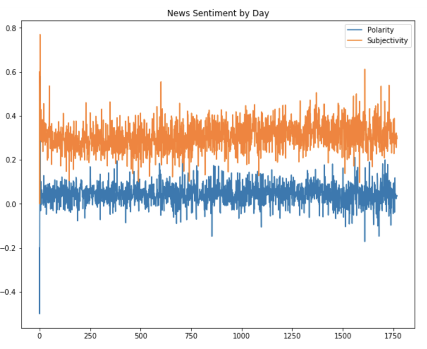
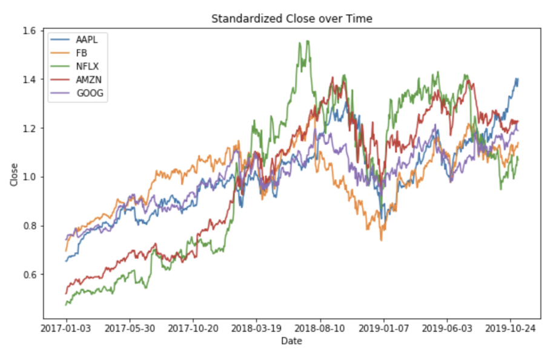

# Midterm Report

### Problem Statement
Can using relevant news articles make a significant addition to stock price prediction models?

### Dataset

Our dataset consists of news articles from the NY Times, stock data from Facebook, Netflix, Amazon, Google, and Apple, and stock index data for the Dow Jones Industrial Average and the S&P 500. All of our data ranges over the span of nearly three years, from January 1, 2017 to October 31, 2019, although our stock and index data does not include weekends or holidays, as the markets are closed on these days.

#### NY Times Articles
Our article data came from the NY Times Article Search API. For each day, we collected all news produced in the "Business Day", "U.S.", and "World" sections. So far, we have collected 51,253
news pieces from 2015 - 2019. We will continue to collect more years, but we are rate limited by the API. 

Surprisingly, this also included some articles from other sources such as the AP and Reuters. The news came in the form of articles, multimedia, and audio. However, we will just be using the metadata. It's impossible to determine if we are missing articles, but there were some columns that were missing values. Some of the missing data had reasonable interpretations such as an article not having a subtitle or otherwise could be placed in an "Other" category. 

For our primary data cleaning, we removed columns that weren't relevant or had a very large proportion of missing data. Additionally, we used one-hot encoding for several text columns (such as section, source, material type, and news desk) to make them more useful. This will also help us determine if we should filter the articles by the above categories later in the project. The API also provided keywords, from which we picked the 100 most common across all articles to encode as many-hot. 

##### Sentiment Analysis

The metadata also included larger text blocks such as headlines and abstracts. Our first attempt at using this data was performing sentiment analysis. We used a library that gave a polarity and subjectivity score. As you can see in the graph on the left, the average sentiment does vary by day. We are also considering training our own sentiment analysis model that will be able to better learn how to read headlines and abstracts that may be more sensationalized than typical text. 

Each day has a varying number of articles (roughly 18 - 37). We have tried different methods of condensing the articles to features, such as taking the sum or mean across each day. We have also considered trying to pick the day's "top" news or looking at articles one by one. There are 1,765 days covered by these news articles. With the different encodings, we currently have 186 features.

#### Stock and Index Data
Our stock and index data is in the following format:

For each date, we have the open, close, high, low, and adjusted close prices, as well as the volume. For any of these columns, we can calculate the percent difference between the previous date and the current date to indicate whether a feature increased or decreased and by how much since the past day. For example, we computed Close_Diff, the percent difference between the closing price on the current date and the closing price on the previous date. This can be useful as a target variable rather than directly using price since it takes into account that changes in price are more or less significant depending on what the current price is. 

In all of our stock and index datasets, there are 713 dates present. We will continue to add to this as we get news data for more years. The only missing data are the days for which the markets were closed (weekends and holidays). 

Here is a visualization of our stock data, with each stock’s prices scaled by its mean. 

### Modeling
For our modeling, we plan to compare baseline models that do not incorporate news data with more advanced models that do incorporate news data. For training, validation, and testing purposes, our dataset can be split by taking the most recent 20% as testing and the least recent 70% as training, with the rest as validation. 

#### Baseline
We plan on using models that are trained without news data as our baseline models. If we can see a significant improvement after modeling with the news data as a feature, then we will have good evidence that news data can be used as a supplemental data source to usefully improve stock price prediction. 

Some simple methods we can use to produce baseline predictions include:
    - Predicting the previous day's price as the current day's price (last value prediction)
    - Using a moving average of prices for the past n days to predict the current day's price
    - Using a time series based linear regression without news data and with the previous n days as features

#### Advanced 
We plan on testing out several additional models that incorporate news data to compare to our baseline models. Besides working with more complex models, we will also be creating features that could be useful to these models. These features include:
Average news article sentiment of the past n days
The output of a model trained to predict an index’s movement from the past n days of news articles
Moving average of percent price change of the last n days

Models we plan to test include:
    - Linear regression
    - ARIMA
    - LSTM

Note: We can additionally train and test these models with and without news-related features and compare their performance to look for any significant performance increases after adding news-related features.

### Testing 
To test the effectiveness of our models, we plan on comparing the RMSE of our baseline models with the RMSE of our advanced models as they perform on our testing portion of our dataset.

### What Next?

Data collection has taken up the  majority of the time we have spent working on our project thus far. We have incurred difficulties with respect to finding and downloading data from our desired sources using APIs. Now that we have collected an adequate amount of data, our next steps include actually developing a model to train our data on. 

Since our idea involves using financial articles to predict stock trends, the majority of the data that we will be using to base our predictions on is string values. For this reason, we intend to have to take into consideration the many complications that result from datasets of these type of values. Firstly, we plan to replace any missing values with empty strings so the model will not interpret them as any other data type. With regards to model design, we intend to employ a many-hot encoding method to attempt to map certain keywords to a label. For example, when considering titles such as “Falling Euro Fans Fears of a Regional Slowdown”, our model would acknowledge terms such as “Falling”, “Fears”, or “Slowdown” through many-hot encoding. Then, given a title including these keywords, it should predict that the stock index will decline, as these terms give the sentiment of low consumer confidence which can negatively impact the stock market as a whole. 
 
On the other hand, it’s important to note that we are not anticipating that this strategy will be that black and white. For example, what if another title had been worded as “As the Euro Falls, Many Fear a Regional Slowdown”? In this case, we would need to consider both the keywords “Falling” and “Falls” as well as “Fears” and “Fear”. For this reason, we foresee the use of some natural language processing (NLP) techniques so that the model can pick up on different tenses and pluralities of these keywords. 
Another issue that we are considering is the time difference between when the article was published on a given day and the stock index reported on that given day. For example, if our labels report the stock index for a given day at 2:00PM, our model should not be training on data that was reported at 7:00PM that same day as that information has no impact on a previously reported stock index. We need to make sure that we circumvent this issue for every single row in our dataset so that we are making useful predictions. 

After we’ve dealt with the aforementioned factors, we will test our model on a smaller subset of our dataset. In the event that our model overfits, we intend on evaluating the complexity of our model. Perhaps then the many-hot encoding contains too many keywords which could cause conflicts with extremely wordy titles. We could then explore removing some keywords from the many-hot dictionary. This is the equivalent to removing features from our model which should, by default, decrease our model complexity. In the event that our model underfits, we intend to employ a similar yet opposite strategy to that of solving overfitting. This involves scouring our dataset to locate more keywords to incorporate into our many-hot model. This will add more features to our model and will hopefully increase the complexity of our model. 
